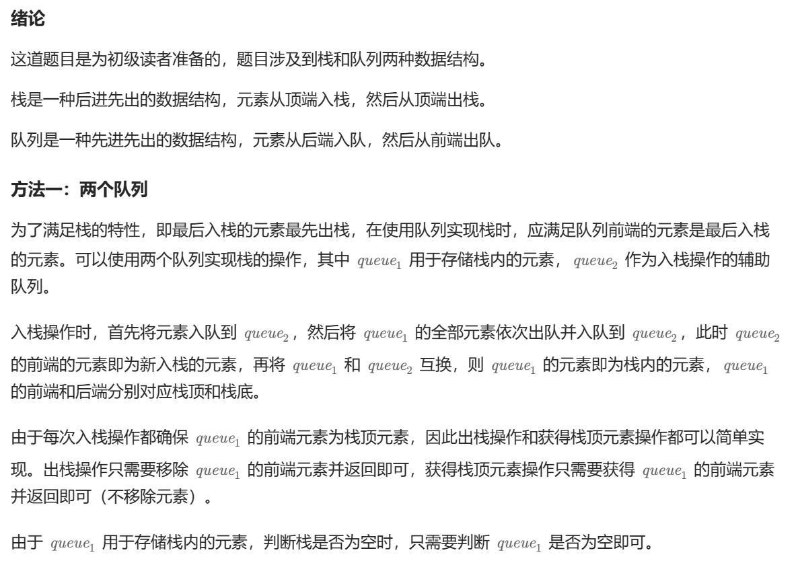
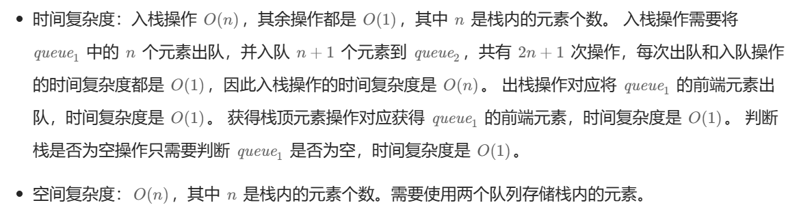

# [0225.用队列实现栈](https://leetcode.cn/problems/implement-stack-using-queues/)

`时间：2023.11.14`

## 题目

请你仅使用两个队列实现一个后入先出（LIFO）的栈，并支持普通栈的全部四种操作（`push`、`top`、`pop` 和 `empty`）。

实现 `MyStack` 类：

- `void push(int x)` 将元素 x 压入栈顶。
- `int pop()` 移除并返回栈顶元素。
- `int top()` 返回栈顶元素。
- `boolean empty()` 如果栈是空的，返回 `true` ；否则，返回 `false` 。

**示例1：**

```
输入：
["MyStack", "push", "push", "top", "pop", "empty"]
[[], [1], [2], [], [], []]
输出：
[null, null, null, 2, 2, false]

解释：
MyStack myStack = new MyStack();
myStack.push(1);
myStack.push(2);
myStack.top(); // 返回 2
myStack.pop(); // 返回 2
myStack.empty(); // 返回 False
```

## 代码

#### 方法：两个队列

##### 思路



##### 代码

```c++
#include <iostream>
#include <queue>

using namespace std;

class MyStack {
public:
    queue<int> queue1;
    queue<int> queue2;

    MyStack() {

    }
    
    void push(int x) {
        queue2.push(x);
        while (!queue1.empty()) {
            queue2.push(queue1.front());
            queue1.pop();
        }
        swap(queue1, queue2);
    }
    
    int pop() {
        int result = queue1.front();
        queue1.pop();
        return result;
    }
    
    int top() {
        int result = queue1.front();
        return result;
    }
    
    bool empty() {
        return queue1.empty();
    }
};
```

##### 复杂度分析

