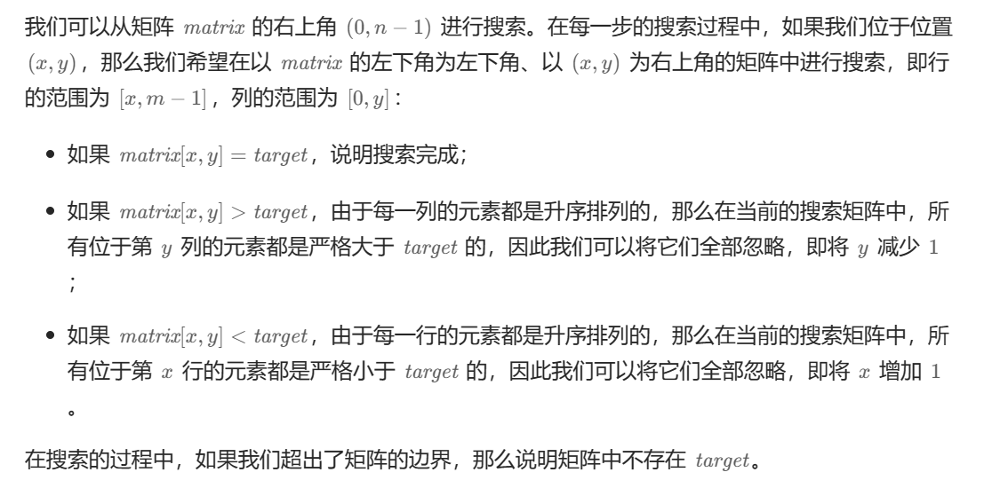
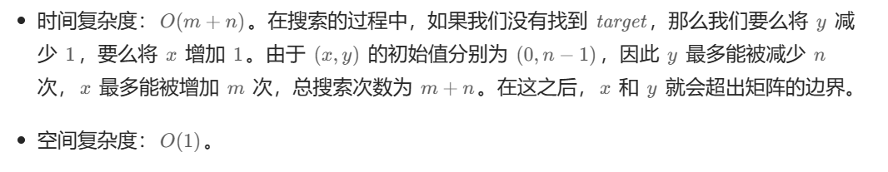

# [0240.搜索二维矩阵 II](https://leetcode.cn/problems/search-a-2d-matrix-ii/)

`时间：2023.11.16`

## 题目

编写一个高效的算法来搜索 `m x n` 矩阵 `matrix` 中的一个目标值 `target` 。该矩阵具有以下特性：

- 每行的元素从左到右升序排列。
- 每列的元素从上到下升序排列。

**示例1：**


```
输入：matrix = [[1,4,7,11,15],[2,5,8,12,19],[3,6,9,16,22],[10,13,14,17,24],[18,21,23,26,30]], target = 5
输出：true
```

**示例2：**


```
输入：matrix = [[1,4,7,11,15],[2,5,8,12,19],[3,6,9,16,22],[10,13,14,17,24],[18,21,23,26,30]], target = 20
输出：false
```

## 代码

#### 方法：Z 字形查找

##### 思路



##### 代码

```c++
#include <iostream>
#include <vector>

using namespace std;

class Solution {
public:
    bool searchMatrix(vector<vector<int>>& matrix, int target) {
        int xsize = matrix.size(), ysize = matrix[0].size();
        int x = xsize - 1, y = 0;
        while (x >= 0 && x < xsize && y >= 0 && y < ysize) {
            if (matrix[x][y] == target) {
                return true;
            }
            else if (matrix[x][y] > target) {
                x--;
            }
            else {
                y++;
            }
        }
        return false;
    }
};

int main() {
    Solution solution;
    // Test Case
    vector<vector<int>> matrix = {{1,4,7,11,15},
                                  {2,5,8,12,19},
                                  {3,6,9,16,22},
                                  {10,13,14,17,24},
                                  {18,21,23,26,30}};

    int target = 5;
    bool result = solution.searchMatrix(matrix, target);
    cout << "Output: " << (result ? "true" : "false") << endl;
    system("pause");
    return 0;
}
```

##### 复杂度分析

