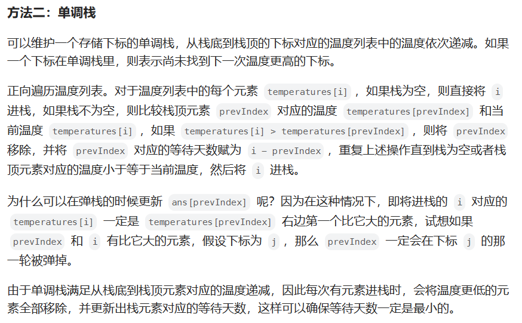
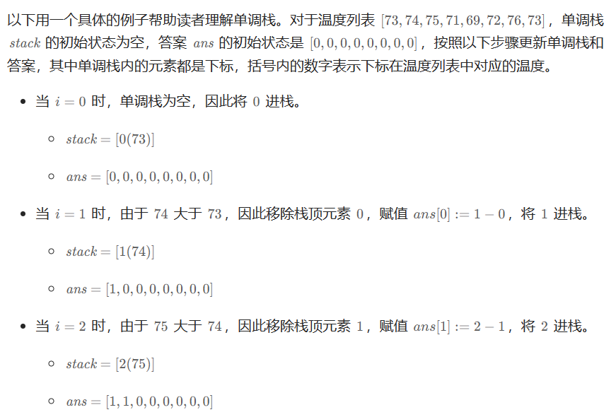
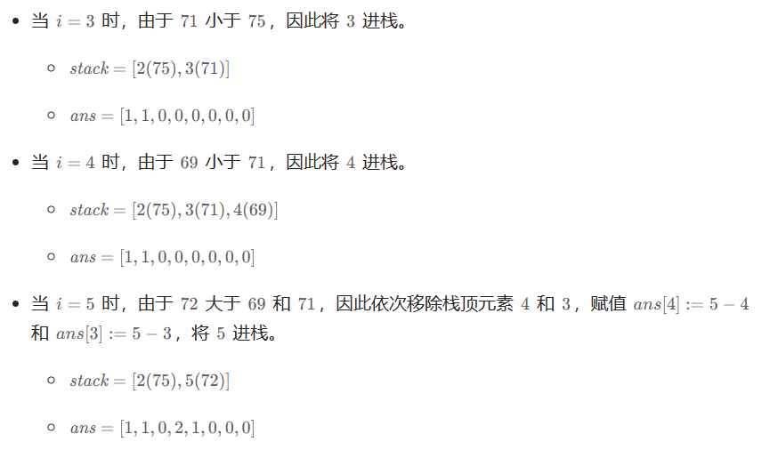
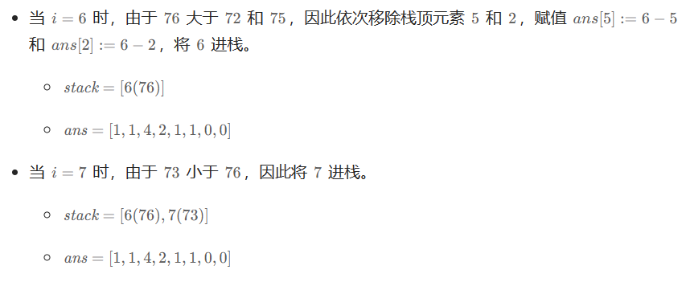
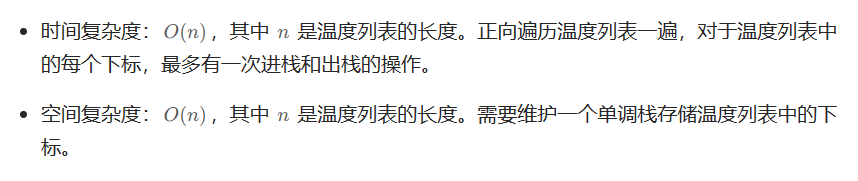

# [739.每日温度](https://leetcode.cn/problems/daily-temperatures/)

`时间：2023.8.2`

## 题目

给定一个整数数组 `temperatures` ，表示每天的温度，返回一个数组 `answer` ，其中 `answer[i]` 是指对于第 `i` 天，下一个更高温度出现在几天后。如果气温在这之后都不会升高，请在该位置用 `0` 来代替。

**示例1：**

```
输入: temperatures = [73,74,75,71,69,72,76,73]
输出: [1,1,4,2,1,1,0,0]
```

**示例2：**

```
输入: temperatures = [30,40,50,60]
输出: [1,1,1,0]
```

**示例3：**

```
输入: temperatures = [30,60,90]
输出: [1,1,0]
```

## 代码

#### 方法：单调栈法

##### 思路

强烈推荐！！！：https://www.bilibili.com/video/BV1my4y1Z7jj/?spm_id_from=333.788&vd_source=7f6ba21197bdeac9f512077e3b57e148

https://leetcode.cn/problems/daily-temperatures/solutions/283196/mei-ri-wen-du-by-leetcode-solution/









##### 代码

```java
import java.util.Deque;
import java.util.ArrayDeque;

class Solution {
    // 单调栈法
    public int[] dailyTemperatures(int[] temperatures) {
        int len = temperatures.length;
        int[] result = new int[len];
        Deque<Integer> mystack = new ArrayDeque<>();
        for (int i = 0; i < len; i++) {
            while (!mystack.isEmpty() && temperatures[i] > temperatures[mystack.peek()]) {
                result[mystack.peek()] = i - mystack.peek();
                mystack.pop();
            }
            mystack.push(i);
        }
        return result;
    }

    public static void main(String[] args) {
        int[] temperatures = {73,74,75,71,69,72,76,73};
        Solution sol = new Solution();
        int[] result = sol.dailyTemperatures(temperatures);
        for (int i = 0; i < result.length; i++) {
            System.out.print(result[i] + " ");
        }
        System.out.println();
    }
}
```

##### 复杂度分析

